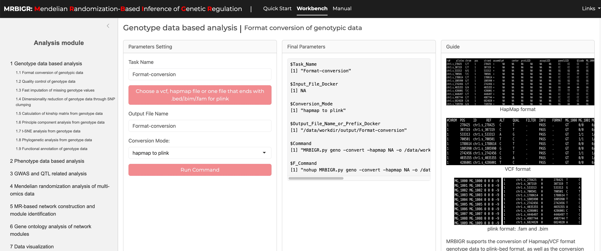

# <center>Quickstart</center>
<center>Installation and quickstart</center>
___
This section is mainly intended for the installation of MRBIGR and the briefly introduction of several typical usage of MRBIGR to help users get started quickly. Details and advanced usage of MRBIGR, please see [Tutorial section](Tutorial.md).

___
## 1. Installation of MRBIGR
### 1.1 Download MRBIGR 
```bash
git clone https://gitee.com/crazyhsu/MRBIGR.git
```
### 1.2 Installation using [docker](https://docs.docker.com/engine/install/) (recommended)
```bash
cd MRBIGR
docker build -t mrbigr_image .
curr_dir=$(pwd)
docker run -dit --name mrbigr_env -p 3838:3838 \
    -v $curr_dir/MRBIGR_data:/root/MRBIGR/MRBIGR_data \
    -v $curr_dir/MRBIGR_output/demo:/root/MRBIGR/MRBIGR_output/demo \
    -v $curr_dir/MRBIGR_log:/root/MRBIGR/MRBIGR_log \
    -e SHINY_INPUT_PATH=/root/MRBIGR/MRBIGR_data \
    -e SHINY_OUTPUT_PATH=/root/MRBIGR/MRBIGR_output/demo \
    -e SHINY_LOG_PATH=/root/MRBIGR/MRBIGR_log \
    -e SHINY_ROOT_PATH=/root/MRBIGR \
    mrbigr_image:latest
```

If no exception is thrown out, please enter the `http://localhost:3838` in the browser and then you will see the following GUI:


 __Note__: If you encounter the issue like below:
```
#0 building with "default" instance using docker driver

#1 [internal] load build definition from Dockerfile
#1 transferring dockerfile: 1.10kB done
#1 DONE 0.2s

#2 [internal] load metadata for docker.io/crazyhsu/mrbigr_env:v1.2
#2 ERROR: failed to authorize: failed to fetch anonymous token: Get "https://auth.docker.io/token?scope=repository%3Acrazyhsu%2Fmrbigr_env%3Apull&service=registry.docker.io": dial tcp [2a03:2880:f130:83:face:b00c:0:25de]:443: connectex: A connection attempt failed because the connected party did not properly respond after a period of time, or established connection failed because connected host has failed to respond.
------
 > [internal] load metadata for docker.io/crazyhsu/mrbigr_env:v1.2:
------
Dockerfile:1
--------------------
   1 | >>> FROM crazyhsu/mrbigr_env:v1.2
   2 |     
   3 |     ENV CONDA_DEFAULT_ENV=mrbigr
--------------------
ERROR: failed to solve: crazyhsu/mrbigr_env:v1.2: failed to authorize: failed to fetch anonymous token: Get "https://auth.docker.io/token?scope=repository%3Acrazyhsu%2Fmrbigr_env%3Apull&service=registry.docker.io": dial tcp [2a03:2880:f130:83:face:b00c:0:25de]:443: connectex: A connection attempt failed because the connected party did not properly respond after a period of time, or established connection failed because connected host has failed to respond.
```
Please try the following code:
```bash
cd MRBIGR
docker pull crazyhsu/mrbigr_env:v1.2  # direct pull the images without authorize
docker build -t mrbigr_image .
# or
wget https://zenodo.org/records/13955396/files/mrbigr_env_v1.2.tar
docker load -i mrbigr_env_v1.2.tar
docker build -t mrbigr_image .
```
Then run the docker container:
```
curr_dir=$(pwd)
docker run -dit --name mrbigr_env -p 3838:3838 \
    -v $curr_dir/MRBIGR_data:/root/MRBIGR/MRBIGR_data \
    -v $curr_dir/MRBIGR_output/demo:/root/MRBIGR/MRBIGR_output/demo \
    -v $curr_dir/MRBIGR_log:/root/MRBIGR/MRBIGR_log \
    -e SHINY_INPUT_PATH=/root/MRBIGR/MRBIGR_data \
    -e SHINY_OUTPUT_PATH=/root/MRBIGR/MRBIGR_output/demo \
    -e SHINY_LOG_PATH=/root/MRBIGR/MRBIGR_log \
    -e SHINY_ROOT_PATH=/root/MRBIGR \
    mrbigr_image:latest
```
### 1.3 Installation using conda
#### 1.3.1 Build and install
```bash
conda create -n mrbigr python=3.7 -y
conda activate mrbigr
```
#### 1.3.2 Install dependencies
```bash
cd MRBIGR  
python setup.py build  
python setup.py install  
```
#### 1.3.3. Install dependencies 
```bash
pip install pyranges  
conda install -y -c conda-forge r-rcppeigen r-xml r-rsqlite r-europepmc r=3.6 rpy2 vcftools 
Rscript -e 'install.packages(c("data.table", "ggplot2", "ggsignif", "ggrepel","Matrix", "igraph", "network", "GGally", "sna","tidyr","ggraph","lme4","ggpubr","pheatmap","factoextra", "R.utils"), repos="https://cloud.r-project.org")' 
Rscript -e 'if (!requireNamespace("BiocManager", quietly = TRUE)) install.packages("BiocManager", repos="https://cloud.r-project.org");BiocManager::install(c("AnnotationForge","clusterProfiler","ggtree"))'  
Rscript -e 'install.packages("bigsnpr", dependence=T, repos="https://cloud.r-project.org")'
Rscript -e 'install.packages("https://cran.r-project.org/src/contrib/Archive/FactoMineR/FactoMineR_1.42.tar.gz", repos=NULL)'
```
#### 1.3.4 Set environment variables
```bash
echo "export PATH=`pwd`/utils:\$PATH" >> ~/.bashrc  
echo "export LD_LIBRARY_PATH=`pwd`/utils/libs:\$LD_LIBRARY_PATH" >> ~/.bashrc
source ~/.bashrc
```
#### 1.3.5 Set up MRBIGR GUI app
```bash
Rscript -e "install.packages(c('shiny','bslib','shinyFiles','shinyalert'), repos='https://mirrors.tuna.tsinghua.edu.cn/CRAN/')"

Rscript -e "shiny::runApp('MRBIGR-I/app.R', host = '0.0.0.0', port = 3838)"
```

 __Depends__: R(>=3.6), python(>=3.7)

___
## 2. Data preparation
Using MRBIGR for basic analysis requires only <a href="#genotypic_data">genotypic</a> and <a href="#phenotypic_data">phenotypic</a> data. Users can perform advanced functional analyses and generate visualizations through the use of built-in functions and their combinations ([Details in the document](Tutorial.md)). The example datasets used below are from [MRBIGR_data](https://zenodo.org/records/13955396/files/MRBIGR_data.20241019.tar.gz), which contains all the data used for our paper "MRBIGR: a versatile toolbox for genetic causal inference in population-scale multi-omics data".
```bash
# download and unpack MRBIGR_data.tar.gz
wget https://zenodo.org/records/13955396/files/MRBIGR_data.20241019.tar.gz -O MRBIGR_data.tar.gz
tar -xvzf MRBIGR_data.tar.gz --transform 's,^MRBIGR_data.20241019,MRBIGR_data,'
rm MRBIGR_data.tar.gz
mkdir MRBIGR_output/demo
```

<h3 id="genotypic_data"> 2.1 Genotypic data</h3>

MRBIGR uses PLINK-bed file format for Genotypic data by default (details see [http://zzz.bwh.harvard.edu/plink/data.shtml#bed](http://zzz.bwh.harvard.edu/plink/data.shtml#bed)). The built-in `geno` module supports converting <a href="#hapmap_format">HapMap</a> or <a href="#vcf_format">VCF</a> formatted genotype files to PLINK-bed format, as well as converting PLINK-bed format to VCF format.

<h4 id="hapmap_format">2.1.1 HapMap file format</h4>

Hapmap is a commonly used format for storing sequence data where SNP information is stored in the rows and taxa information is stored in the columns. This format allows the SNP information (chromosome and position) and genotypes of each taxa to be stored in a single file.

The first 11 columns display attributes of the SNPs and the remaining columns show the nucleotides observed at each SNP for each taxa. The first row contains the header labels and each remaining row contains all the information for a single SNP. The first nine SNPs from the tutorial data (`MRBIGR_data/chr_HAMP_female.hmp`) are presented below.

|rs#           |alleles|chrom|posi  |strand|assembly|center|protLSID|assayLSID|panelLSID|QCdode|CIMBL32|CIMBL89|CIMBL7|CIMBL45|ZHENG58|...|CIMBL46|
|:-------------|:------|:----|:-----|:-----|:-------|:-----|:-------|:--------|:--------|:-----|:------|:------|:-----|:------|:------|:-----|:------|
|chr10.s_74401 |C/T    |10   |74401 |+     |We      |Are   |The     |Maize    |Re       |Seq   |CC     |TT     |CC    |TT     |CC     |...    |TT     |
|chr10.s_76702 |A/G    |10   |76702 |+     |We      |Are   |The     |Maize    |Re       |Seq   |GG     |AA     |GG    |AA     |GG     |...    |AA     |
|chr10.s_92823 |C/T    |10   |92823 |+     |We      |Are   |The     |Maize    |Re       |Seq   |CC     |CC     |CC    |CC     |CC     |...    |CC     |
|chr10.s_94339 |T/A    |10   |94339 |+     |We      |Are   |The     |Maize    |Re       |Seq   |AA     |TT     |AA    |TT     |AA     |...    |TT     |
|chr10.s_94579 |C/G    |10   |94579 |+     |We      |Are   |The     |Maize    |Re       |Seq   |CC     |GG     |CC    |GG     |CC     |...    |GG     |
|chr10.s_94901 |G/A    |10   |94901 |+     |We      |Are   |The     |Maize    |Re       |Seq   |AA     |AA     |AA    |AA     |AA     |...    |AA     |
|chr10.s_94930 |T/G    |10   |94930 |+     |We      |Are   |The     |Maize    |Re       |Seq   |GG     |TT     |GG    |TT     |GG     |...    |TT     |
|chr10.s_108603|C/T    |10   |108603|+     |We      |Are   |The     |Maize    |Re       |Seq   |TT     |CC     |TT    |CC     |TT     |...    |CC     |
|chr10.s_108610|C/T    |10   |108610|+     |We      |Are   |The     |Maize    |Re       |Seq   |TT     |CC     |TT    |CC     |TT     |...    |CC     |

<h4 id="vcf_format">2.1.2 VCF file format</h4>

VCF (Variant Call Format) file is a standard text file format for storing genomic variation information. This format is widely used in genomic research, especially when it comes to the difference between the genome sequence of an individual or a population and the reference genome. VCF files can describe multiple types of genetic variations, such as single nucleotide polymorphisms (SNPs), insertions/deletions (InDels), structural variations, etc.

The basic structure of a VCF file consists of two parts: header information and data lines. The header information starts with ## and contains the file's metadata such as format version, generation program, etc., and defines the column name with the #CHROM line; the data part lists the information of each variant site in detail, including chromosome number, position, identifier, reference and alternative bases, quality score, filtering status, additional information and sample-specific data. The first five SNPs from the converted data (`MRBIGR_output/demo/geno/chr_HAMP_female.vcf.vcf`) are presented below.
```bash
##fileformat=VCFv4.2
##fileDate=20241004
##source=PLINKv1.90
##contig=<ID=10,length=150903390>
##contig=<ID=1,length=306984567>
##contig=<ID=2,length=209800297>
##contig=<ID=3,length=235647547>
##contig=<ID=4,length=246987745>
##contig=<ID=5,length=223818355>
##contig=<ID=6,length=173410493>
##contig=<ID=7,length=182367039>
##contig=<ID=8,length=181101714>
##contig=<ID=9,length=159764980>
##INFO=<ID=PR,Number=0,Type=Flag,Description="Provisional reference allele, may not be based on real reference genome">
##FORMAT=<ID=GT,Number=1,Type=String,Description="Genotype">
#CHROM  POS     ID      REF     ALT     QUAL    FILTER  INFO    FORMAT  CIMBL32 CIMBL89 CIMBL7  CIMBL45 ZHENG58 CML415  CIMBL46 CIMBL70 CIMBL124        CIMBL68 CIMBL77 CML324  CML326  CIMBL69 CIMBL23 CIMBL71 
10      74401   chr10.s_74401   C       T       .       .       PR      GT      0/0     1/1     0/0     1/1     0/0     1/1     1/1     1/1     0/0     1/1     1/1     0/0     0/1     1/1     1/1     1/1     
10      76702   chr10.s_76702   G       A       .       .       PR      GT      0/0     1/1     0/0     1/1     0/0     1/1     1/1     1/1     0/0     1/1     1/1     0/0     0/1     1/1     1/1     1/1     
10      92823   chr10.s_92823   C       T       .       .       PR      GT      0/0     0/0     0/0     0/0     0/0     0/0     0/0     0/0     0/0     0/0     0/0     0/0     0/0     0/0     0/0     0/0     
10      94339   chr10.s_94339   A       T       .       .       PR      GT      0/0     1/1     0/0     1/1     0/0     1/1     1/1     1/1     0/0     1/1     1/1     0/0     1/1     1/1     1/1     1/1     
10      94579   chr10.s_94579   C       G       .       .       PR      GT      0/0     1/1     0/0     1/1     0/0     1/1     1/1     1/1     0/0     1/1     1/1     0/0     1/1     1/1     1/1     1/1    
```

<h3 id="phenotypic_data">2.2 Phenotypic data</h3>

Phenotypic file includes multiple phenotype columns. Taxa names should be in the first column of the phenotypic data file and the remaining columns should contain the observed phenotype from each individual. Missing data should be indicated by either `NaN` or `NA`. MRBIGR supports many types of datasets as phenotypic file, as long as the data is provided in comma-separated value format, i.e., CSV file. The three most commonly used data types are presented below.

#### 2.2.1 Trait file 

The first nine observations in the tutorial data (`MRBIGR_data/blup_traits_final.new.csv`) are displayed as follows:

|Trait|Plantheight       |Earheight        |Earleafwidth      |Earleaflength    |Tasselmainaxislength|Tasselbranchnumber|Leafnumberaboveear|Earlength         |Eardiameter       |Cobdiameter       |Kernernumberperrow|100grainweight    |cobweight        |Kernelwidth       |Silkingtime|Pollenshed       |Headingdate|
|:----|:-----------------|:----------------|:-----------------|:----------------|:-------------------|:-----------------|:-----------------|:-----------------|:-----------------|:-----------------|:-----------------|:-----------------|:----------------|:-----------------|:----------|:----------------|:----------|
|150  |199.40686200000002|84.09240313      |8.415551016       |62.57602963      |26.18701812         |7.0083920310000005|5.446805873       |13.16553466       |3.814461974       |2.3336648540000002|24.01368699       |18.66442693       |18.73223124      |6.948005094       |69.5634    |67.3508          |64.3586    |
|177  |167.7376926       |62.32666383      |8.336793644       |75.84687159999999|26.86362604         |8.25953511        |5.364463679       |13.24180052       |3.664731428       |2.3747896369999997|23.22662586       |22.17517342       |16.69770013      |7.95607262        |69.1351    |67.5734          |66.1437    |
|238  |195.1777397       |65.90031644      |9.38907964        |78.97464118      |27.64054122         |9.749416145       |5.498509112000001 |13.84549223       |3.7085016239999997|2.4834557630000003|23.399574100000002|21.94336045       |17.4338478       |8.18091486        |74.5957    |71.9141          |69.8254    |
|268  |160.7956655       |52.69387703      |8.844888078       |70.42957469      |28.36394677         |6.981059882       |5.635426946       |10.73827719       |3.66728469        |2.257745983       |19.08355482       |18.86634823       |14.05614498      |7.360464037000001 |71.2765    |68.90899999999999|65.6974    |
|501  |170.01783559999998|62.25478889      |8.796211646       |67.83068252      |26.54872089         |6.3387543729999996|5.772344781       |10.33143474       |4.086384316       |2.546535413       |22.25759352       |25.83110804       |17.26231825      |8.435537529       |71.2765    |69.7994          |66.2553    |
|647  |143.4828657       |68.96951963      |6.5188109789999995|65.55214977      |25.94091108         |17.84754152       |4.351873538       |6.8750427389999995|2.557710224       |1.4466421669999998|16.79624763       |11.789889599999999|4.497660526000001|5.1284208730000005|72.24015   |70.9124          |66.7015    |
|812  |164.7820379       |57.30049720000001|8.435240359       |71.97071207      |27.00737492         |7.468018377999999 |4.7605753260000006|11.73433366       |3.678227239       |2.319895255       |21.14170296       |22.99261918       |11.90201965      |8.541258052       |68.7068    |66.4604          |65.6974    |
|1323 |183.0386928       |70.55827585      |10.53762464       |70.99257322      |32.98852183         |5.730474602       |5.672768174       |12.49229884       |4.136537665       |2.9266879930000003|21.17811141       |22.25630796       |24.18210638      |8.20176116        |75.4523    |73.5836          |71.9452    |
|1462 |211.1751917       |88.14599481      |9.699733717       |84.89124385      |34.74483117         |11.73294927       |6.547893356       |17.13560948       |4.340433828       |2.470617348       |32.87164817       |25.7713247        |22.36770487      |8.295569512       |70.9553    |69.0203          |68.0403    |

#### 2.2.2 Gene expression file 

The first nine observations in the tutorial data (`MRBIGR_data/AMP_kernel_transcriptome_v4_FPKM`) are displayed as follows:

|       |Zm00001d007718     |Zm00001d007716|Zm00001d018986    |Zm00001d048402     |Zm00001d048403   |Zm00001d048404    |Zm00001d048407    |Zm00001d048342     |Zm00001d048393    |Zm00001d048394|
|:------|:------------------|:-------------|:-----------------|:------------------|:----------------|:-----------------|:-----------------|:------------------|:-----------------|:-------------|
|05W002 |13.68390968        |0.08887555    |22.46513484       |35.2460181         |90.0115652       |4.245998763       |2.072609286       |0.8325380590000001 |9.159937637999999 |67.86617791   |
|05WN230|0.41449239299999996|0.043290454   |24.22802224       |38.30711955        |77.83880474      |2.5675474190000003|6.337722396       |0.359176224        |11.66285576       |95.13785552   |
|07KS4  |1.514937182        |0.094552666   |20.89936082       |30.22573463        |89.46284399999999|2.86870803        |4.861722385       |1.344393716        |4.40600588        |96.44533135   |
|1462   |2.9976042960000004 |0.069739101   |17.11780085       |19.00876018        |65.92898232      |2.765295001       |5.0446673319999995|0.34219332         |8.192603334       |78.60389131   |
|150    |5.716710774        |0.018280516   |22.47700014       |0.211730029        |64.85073286      |3.2508831189999996|2.072331077       |0.41587338700000004|9.749669454       |59.98792917   |
|177    |0.38862201799999996|0.083882895   |23.34402367       |58.74669505        |72.21102064      |4.7976829819999995|2.037686245       |0.654807971        |13.24835189       |66.17025883   |
|18-599 |0.649410418        |0.082275625   |20.45144972       |0.46588138700000004|78.06259285      |3.971991299       |5.0632273969999995|0.7951806290000001 |13.01598039       |74.97802633   |
|238    |9.543760621        |0.095198605   |20.834385100000002|14.73831069        |71.00077488      |2.627118969       |3.4174614439999997|0.9766994040000001 |1.9633184590000001|36.03050858   |
|268    |1.030472507        |0.11706547    |17.722316199999998|36.98853947        |163.2058748      |1.9805356109999999|15.65963041       |1.206266576        |9.333207445       |101.6617829   |

#### 2.2.3 Metabolite abundance file

The first nine observations in the tutorial data (`MRBIGR_data/E3_log2.normalized_phe.csv`) are displayed as follows:

|ID  |n0004             |n0006             |n0012             |n0014             |n0016             |n0019             |n0020             |n0025             |n0029             |n0033             |
|:---|:-----------------|:-----------------|:-----------------|:-----------------|:-----------------|:-----------------|:-----------------|:-----------------|:-----------------|:-----------------|
|150 |23.85756808279454 |21.52133253560975 |19.429310701409214|17.88465348347412 |23.728581650951327|23.323886129502455|23.144138063805507|20.50688186826299 |21.385744989040916|17.91415735710555 |
|177 |24.060851668708853|22.93337099206989 |18.037252010387334|18.91707191416155 |26.173789983480603|22.863251815465887|22.931568749661043|19.489348200901247|22.200602015093704|18.037252010387334|
|238 |23.697103421767665|22.049263944412104|19.015635556176196|19.50881803882359 |24.13320250890116 |22.41699565411851 |23.9225235204567  |19.36879843924739 |22.117435431711307|18.779568681864543|
|268 |24.31008026193824 |22.356490926193132|19.89504417298552 |19.930126596592963|24.296141071653768|23.39100031911556 |23.101493731065926|19.71230028530486 |22.815189581096966|17.919986412355946|
|647 |24.516531130157624|22.012226573732015|20.2065768091335  |20.477537926576417|25.08131572946815 |24.20955339098966 |24.141022012936638|20.396237881758427|21.164229940027102|19.23724964702257 |
|1462|24.117435193904463|21.826871578478677|20.447584725205136|17.80499437272362 |25.354474345565613|22.707672768009736|22.87829961658445 |18.925789113705253|21.995071856772647|17.82997662112729 |
|4019|24.492283584929798|22.767492845636664|21.008812251998197|18.7339719183688  |24.598325218007993|22.699223579410997|23.142580918608278|19.28771463375869 |21.938764429607698|17.95447465132481 |
|5213|24.759387644740613|21.953048652078188|21.688592242664424|20.353802646644912|26.400803379275068|23.958368717176786|23.16269388084486 |20.56383771559438 |21.78755866516714 |17.638216698650762|
|5237|25.15653497289918 |22.359175010264977|19.336473870765303|18.4374635629781  |25.967192501047197|22.846133284156966|23.165763445593072|19.784368059810987|21.540378285014388|18.86966914228456 |

___
## 3. Quick start of MRBIGR (command line based)
MRBIGR consists of seven analysis modules: genotype based analysis module `geno`, phenotype based analysis module `pheno`, GWAS and SAL related analysis module `gwas`, Mendelian randomization ralated  analysis （three module：Mendelian randomization analysis module `mr`, MR-based network construction module `net` and gene ontology analysis module `go`） and data visulaization module `plot`. Each module can be invoked via a subcommand, and each module also provides several functions which can be called with corresponding parameters. 

In this part, only several commonly used functions in each module are shown as examples. For more detailed instructions or GUI operation, please refer to the [Tutorial section](Tutorial.md).

### 3.1 Genotypic data process
If you hava downloaded [MRBIGR_data](https://zenodo.org/records/13955396/files/MRBIGR_data.20241019.tar.gz) and unpacked it, you will see a set of plink-bed format genotypic data named <font color=blue>chr_HAMP.bed/chr_HAMP.bim/chr_HAMP.fam</font>. 

First, quality control of the original genotypic data should be performed through the below command:
```bash
docker exec -it mrbigr_env MRBIGR.py geno -qc -g chr_HAMP -o geno_qc -od MRBIGR_output/demo -maf 0.05 -mis 0.2 -mind 0.2  
```
The subcommand `geno` invokes the genotype analysis module; parameter `-qc` calls the quality control function; `-g` is the prefix of plink-bed format input genotypic data; `-o` is the output genotypic data prefix; `-od` is the output directory; `-maf` is the MAF for a SNP to be kept; `-mis` is the maximum proportion of missing values for a SNP to be kept; `-mind` is the maximum proportion of missing values for a sample to be kept. After this step, the QC-filtered genotypic data <font color=blue>geno_qc.bed/geno_qc.bim/geno_qc.fam</font> would be generated. 

Then, dimensionality reduction of the original genotypic data could be performed using the below command:
```bash
docker exec -it mrbigr_env MRBIGR.py geno -clump -g MRBIGR_output/demo/geno/geno_qc -o geno -od MRBIGR_output/demo
```
The subcommand geno invokes the genotype analysis module; parameter `-clump` calls the genotype clumping function to keep only one representative SNP per region of LD; `-g` is the prefix of plink-bed format input genotypic data; `-o` is the output genotypic data prefix (`suffix _clump` will be added automatically for the output files); `-od` is the output directory. After this step, the clumped genotypic data <font color=blue>geno_clump.bed/geno_clump.bim/geno_clump.fam</font> would be generated. 

Last, take the dimensional reduced genotypic data as input to perform principal component analysis using the below command:
```bash
docker exec -it mrbigr_env MRBIGR.py geno -pca -g MRBIGR_output/demo/geno/geno_clump -o geno -od MRBIGR_output/demo 
```
The subcommand `geno` invokes the genotype analysis module; parameter `-pca` calls the principal component analysis function; `-g` is the prefix of the plink-bed format input genotypic data; `-o` is the output genotypic data prefix (a suffix `_pca` will be added automatically for the output files); `-od` is the output directory. After this step, an output file named <font color=blue>geno_pca.csv</font> would be generated.

 __Note: the all output will generated in `MRBIGR_output/demo/geno` directory__.

### 3.2 Phenotypic data process
For the example CSV format phenotype file named <font color=blue>blup_traits_final.new.csv</font> in MRBIGR_data, the quality control of the original phenotypic data should be performed through the below command:
```bash
docker exec -it mrbigr_env MRBIGR.py pheno -qc -p blup_traits_final.new.csv -o blup_traits_final_qc -od MRBIGR_output/demo -mis 0.5 -val 0.1 -rout zscore
```
The subcommand `pheno` invokes the phenotype analysis module; parameter `-qc` calls the quality control function; `-p` is the input phenotype matrix; `-o` is the prefix of output file; `-od` is the output directory; `-mis` is the missing rate cutoff; `-val` is the small value cutoff; `-rout` means outlier removal of phenotypic values with the default method. After this step, a QC-filtered Phenotypic data named <font color=blue>blup_traits_final_qc.phe.csv</font> would be generated. 

Then, take this file as input, perform missing phenotypic value imputation through the below command: 
```bash
docker exec -it mrbigr_env MRBIGR.py pheno -imput -p MRBIGR_output/demo/pheno/blup_traits_final_qc.phe.csv -o blup_traits_final_qc_imput -od MRBIGR_output/demo
```
The subcommand `pheno` invokes the phenotype analysis module; parameter `-imput` calls the phenotype imputation function; `-p` is the input phenotype matrix; `-o` is the prefix of output file; `-od` is the output directory. After this step, a phenotype file named <font color=blue>blup_traits_final_qc_imput.phe.csv</font> with no `NA` value would be generated. 

Last, take this file as input to perform phenotypic value normalization using the below command:
```bash
docker exec -it mrbigr_env MRBIGR.py pheno -scale -p MRBIGR_output/demo/pheno/blup_traits_final_qc_imput.phe.csv -o blup_traits_final_qc_imput_norm -od MRBIGR_output/demo -boxcox -minmax  
```
The subcommand `pheno` invokes the phenotype analysis module; parameter `-scale` calls the phenotype scaling/normalization/standardization/transformation function; `-p` is the input phenotype matrix; `-o` is the prefix of output file; `-od` is the output directory; `-boxcox` and `-minmax` means perform both box-cox normalization and min-max scaling of the input data. After this step, a phenotype file named `blup_traits_final_qc_imput_norm.phe.csv` with normalized and scaled phenotypic values would be generated.

In some cases, phenotypic data are collected from different environment or years, which should be merged through appropriate algorithm such as `mean-values` or `BLUP` before further analysis. Here is an example, take one trait from different environment as input, the below command line will merge all the columns using BLUP algorithm:
```bash
docker exec -it mrbigr_env MRBIGR.py pheno -merge -p MRBIGR_data/blup_traits_final.new.csv -o blup_traits_final.blup -od MRBIGR_output/demo -mm blup
```
The subcommand `pheno` invokes the phenotype analysis module; parameter `-merge` calls the phenotype merge function; `-p` is the input phenotype matrix for a trait in CSV format; `-o` is the prefix of output file; `-od` is the output directory; `-mm` is the merge method. After this step, a phenotype file named `blup_traits_final.blup.phe.csv` with BLUP merged phenotypic values would be generated.

 __Note: the all output will generated in `MRBIGR_output/demo/pheno` directory__.

### 3.3 GWAS and SAL detection
Take the plink-bed format genotypic data and CSV format phenotypic data as inputs, GWAS can be performed through the below command:
```bash
docker exec -it mrbigr_env MRBIGR.py gwas -gwas -model gemma_mlm -thread 12 -g MRBIGR_data/chr_HAMP -p MRBIGR_data/AMP_kernel_transcriptome_v4 -od MRBIGR_output/demo  
```
The subcommand `gwas` invokes the GWAS and SAL analysis module; parameter `-gwas` calls the GWAS function; `-model` is the model to fit, with linear mixed model (lmm) in `gemma` by default; `-thread` is the thread number to run the command; `-g` is the plink-bed format input Genotypic data; `-p` is the CSV format phenotypic data; `-od` is the output directory. After this step, an output directory named `MRBIGR_output/demo/gwas/gemma/lmm` would be generated with the GWAS result files named <font color=blue>Zm00001dxxxxx.assoc.txt</font> in it. 

 __Note: the exact output directory is depend on the model you selected, where `-model gemma_mlm` means the final output directory will be `MRBIGR_output/demo/gwas/gemma/lmm`__.

Then, SAL can be determined using the below command based on the GWAS results:
```bash
docker exec -it mrbigr_env MRBIGR.py gwas -qtl -g MRBIGR_data/chr_HAMP -thread 6 -i MRBIGR_output/demo/gwas/gemma/lmm -o qtl_output -od MRBIGR_output/demo -p1 1e-5 -p2 1e-3 -p2n 5  
```
The subcommand gwas invokes the GWAS and SAL analysis module; parameter `-qtl` calls the SAL detection function; `-thread` is the thread number to run the command; `-i` is the GWAS result directory; `-o` is the output file prefix; `-od` is the output directory; `-p1` is the significance threshold for index SNPs used to determine SALs; `-p2` is the secondary significance threshold for clumped SNPs used to determine the reliability of SALs; `-p2n` is secondary significance SNP number in a SAL. After this step, an output file named <font color=blue>qtl_output.qtl_res.csv</font> would be generated in `MRBIGR_output/demo/gwas/qtl`. 

If you want to generate manhattan-plots and QQ-plots for visualization of the GWAS results, the below command should be helpful:
```bash
docker exec -it mrbigr_env MRBIGR.py gwas -visual -thread 12 -i MRBIGR_output/demo/gwas/gemma/lmm -od MRBIGR_output/demo -multi -q MRBIGR_output/demo/gwas/qtl/qtl_output.qtl_res.csv   
```
The subcommand `gwas` invokes the GWAS and SAL analysis module; parameter `-visual` calls the visualization function; `-thread` is the thread number to run the command; `-i` is the GWAS result directory; `-od` is the output directory for the generated plots files; parameters `-multi` and `-q` are optional, if `-multi` is set to generate a multi-traits manhattan-plot, `-q` which is the SAL result file also need to be set.

### 3.4 Mendelian randomization (MR) related analysis
Take the plink-bed format genotypic data, CSV format exposure data, CSV format exposure SAL data and CSV format outcome data as inputs, MR analysis can be performed through the below command:
```bash
docker exec -it mrbigr_env MRBIGR.py mr -g MRBIGR_data/chr_HAMP -exposure MRBIGR_data/AMP_kernel_transcriptome_v4 -qtl MRBIGR_output/demo/gwas/qtl/qtl_output.qtl_res.csv -outcome MRBIGR_data/blup_traits_final.new.csv -mlm -thread 12 -o g2p -od MRBIGR_output/demo 
```
The subcommand `mr` invokes the MR analysis module; parameter -exposure is the CSV format exposure data; -outcome is the CSV format outcome data; `-qtl` is the CSV format exposure SAL data; `-thread` is the thread number to run the command; `-g` is the plink-bed format input Genotypic data; `-mlm` represents perform MR analysis through mixed linear model; `-o` is the prefix of output file; `-od` is the output directory. After this step, a MR result file named <font color=blue>g2p.MR.csv</font> would be generated. 

It also can take the CSV format population gene expression data and CSV format gene SAL data as inputs, pairwise genes MR analysis can be performed through the below command:
```bash
docker exec -it mrbigr_env MRBIGR.py mr -g MRBIGR_data/chr_HAMP -gene_exp MRBIGR_data/AMP_kernel_transcriptome_v4 -pairwise -mlm -qtl MRBIGR_output/demo/gwas/qtl/qtl_output.qtl_res.csv -thread 12 -o gene_pairwise_mr_out -od MRBIGR_output/demo
```
The subcommand `mr` invokes the MR analysis module; parameter `-gene_exp` is the CSV format population gene expression data; `-qtl` is the CSV format gene SAL data; `-thread` is the thread number to run the command; `-g` is the plink-bed format input Genotypic data; `-mlm` represents perform MR analysis through mixed linear model; `-o` is the prefix of output file; `-od` is the output directory. After this step, a MR result file named <font color=blue>gene_pairwise_mr_out.MR.csv</font> would be generated. 

If you want to perform MR analysis between transcription factor and genes it targets, the below command should be helpful:
```bash
mkdir MRBIGR_output/demo/tmp/
head -100 MRBIGR_data/gene.anno.tsv > MRBIGR_output/demo/tmp/test_head100_genefunc.txt
tail -100 MRBIGR_data/gene.anno.tsv > MRBIGR_output/demo/tmp/test_tail100_genefunc.txt

docker exec -it mrbigr_env MRBIGR.py mr -g MRBIGR_data/chr_HAMP -gene_exp MRBIGR_data/AMP_kernel_transcriptome_v4 -tf MRBIGR_output/demo/tmp/test_head100_genefunc.txt -target MRBIGR_output/demo/tmp/test_tail100_genefunc.txt -mlm -qtl MRBIGR_output/demo/gwas/qtl/qtl_output.qtl_res.csv -threads 12 -o tf_test_mr_out -od MRBIGR_output/demo
```
The subcommand `mr` invokes the MR analysis module; parameter `-gene_exp` is the CSV format population gene expression data; `-qtl` is the CSV format transcription factor SAL data; `-tf` is the transcription factor annotation file; `-target` is the annotation files for genes targeted by transcription factors; `-thread` is the thread number to run the command; `-g` is the plink-bed format input Genotypic data; `-mlm` represents perform MR analysis through mixed linear model; `-o` is the prefix of output file; `-od` is the output directory. After this step, a MR result file named <font color=blue>tf_test_mr_out.MR.csv</font> would be generated.

 __Note: the all output will generated in `MRBIGR_output/demo/mr` directory__.

### 3.5 MR-based network construction
Take the CSV format MR analysis data as input, MR based network analysis can be performed through the below command:
```bash
docker exec -it mrbigr_env MRBIGR.py net -mr MRBIGR_output/demo/mr/gene_pairwise_mr_out.MR.csv -plot -o net_out -od MRBIGR_output/demo
```
The subcommand `net` invokes the MR based network analysis module; parameter `-mr` is the CSV format MR analysis data; `-plot` represents plot network for each identified network module; `-o` is the prefix of output file; `-od` is the output directory. After this step, network edgelist file <font color=blue>net_out.edge_list</font>, ClusterONE software result <font color=blue>net_out.clusterone.result.csv</font>, network module plot <font color=blue>net_out.module*.pdf</font> and final network module file <font color=blue>net_out.module.csv</font> would be generated. 

 __Note: the all output will generated in `MRBIGR_output/demo/net` directory__.

### 3.6 Gene ontology analysis of network modules
Take the CSV format network module data, Tabular format gene ontology annotation of each gene data and Tabular format gene annotation data as inputs, gene ontology enrichment analysis of each module can be performed through the below command:
```bash
csvtk sep -f 3 -t MRBIGR_data/gene.anno.tsv -s ":" -n chr,start-end,strand | csvtk sep -f start-end -t -s "-" -n start,end | csvtk cut -f 1,5,8,9,7,2 -t | csvtk rename -t -f 1-6 -n "gene_id,chr,start,end,stard,annotation" -o MRBIGR_output/demo/tmp/gene_anno.txt

docker exec -it mrbigr_env MRBIGR.py go -gene_lists MRBIGR_output/demo/net/net_out.module.csv -go_anno MRBIGR_data/maize.genes2go.txt -gene_info MRBIGR_output/demo/tmp/gene_anno.txt -o go_out -od MRBIGR_output/demo
```
The subcommand `go` invokes the gene ontology enrichment analysis module; parameter `-gene_lists` is the CSV format network module data; `-go_anno` is the tabular format gene ontology annotation of each gene data; `-gene_info` is the tabular format gene annotation data; `-o` is the prefix of output file; `-od` is the output directory. After this step, gene ontology enrichment analysis result <font color=blue>go_out.GO.csv</font>, visualized results of functional enrichment results <font color=blue>go_out.BP.dotplot.pdf</font>, <font color=blue>go_out.MF.dotplot.pdf</font> and <font color=blue>go_out.CC.dotplot.pdf</font> would be generated. 

 __Note: the all output will generated in `MRBIGR_output/demo/go` directory__.
